<!-- ─────────────────────────────────────────────────────────────
     ✦  sneha's crypt  ✦   black · pink · a little bit spooky
     all artwork lives in ./assets and is hand-made animated SVG.
     the three games come from .github/workflows/arcade.yml
     ───────────────────────────────────────────────────────────── -->

  

  

  
  
  

  

  
  

  

  
  

  

  

<!-- the games below are generated by the "summon the midnight arcade" action.
     they show up after its first run (Actions tab → Run workflow). -->

  

  

